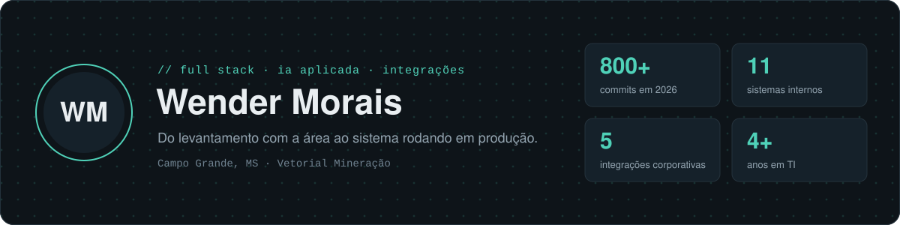

  

---

## Sobre mim

Desenvolvedor na **Vetorial Mineração**, onde construo e opero os sistemas internos da empresa, do levantamento com a área usuária ao servidor em produção.

Comecei no suporte, passei pela infraestrutura e hoje desenvolvo. Por isso segurança, disponibilidade e operação entram no projeto desde a primeira linha de código, e não depois do deploy.

## O que eu faço

- **Desenvolvimento:** aplicações web e PWA com React, Node.js e PostgreSQL, pensadas para mobile e uso offline
- **Integrações:** SAP Business One (HANA), Nimbi, Microsoft 365, Entra ID (SSO) e Google Cloud
- **IA aplicada:** IA generativa no desenvolvimento, na documentação e na automação de processos
- **Infraestrutura:** servidores Linux com nginx, PM2 e Docker, com hardening e padronização de publicação

## Sistemas que construí

Sistemas internos em produção ou em desenvolvimento. O código é privado; aqui fica o que cada um resolve.

| Sistema | O que resolve | Destaque técnico |
|---|---|---|
| Portal de inteligência de mercado | Notícias, cotações e indicadores do setor em um só lugar para diretoria e comercial | Coleta automatizada e curadoria com IA |
| Gestão de projetos e sprints | Acompanhamento de projetos da TI por sprint, com visão para gestores | SSO corporativo e perfis de acesso |
| Vistoria de extintores e hidrantes | Inspeção em campo com registro fotográfico, substituindo planilhas | PWA com uso offline |
| Painel de cotações de commodities | Cotações de minério, gusa, sucata e coque para decisão da diretoria | Integração com base de dados de mercado |
| Metas estratégicas (BSC) | Acompanhamento das metas estratégicas da empresa | Painel executivo |
| Extrator de dados de suprimentos | Dados de compras disponíveis para análise gerencial | ETL de API para Power BI |

## Stack

**Front-end**

**Back-end e dados**

**Infraestrutura e cloud**

## Atividade

## Trajetória

| Período | Função |
|---|---|
| fev/2026 até hoje | Desenvolvedor Full Stack e IA Aplicada, Vetorial Mineração |
| set/2025 a fev/2026 | Analista de Infraestrutura e Operações de TI, Vetorial Mineração |
| jul/2025 a set/2025 | Analista de Tecnologia Pleno, AZ Tecnologia em Gestão |
| 2022 a 2025 | Suporte e Infraestrutura de TI, Aegea Saneamento |

## Formação e certificações

- **Estácio:** Ciências da Computação
- **ExperiêncIA SENAI:** Inteligência Artificial e Tecnologias Emergentes
- **Certificações:** COBIT 2019, ITIL 4, Fortinet NSE e Microsoft (Azure, AI e Security)

---

Boa parte do meu trabalho fica em repositórios privados corporativos. Os projetos públicos aqui são pessoais ou de estudo.
